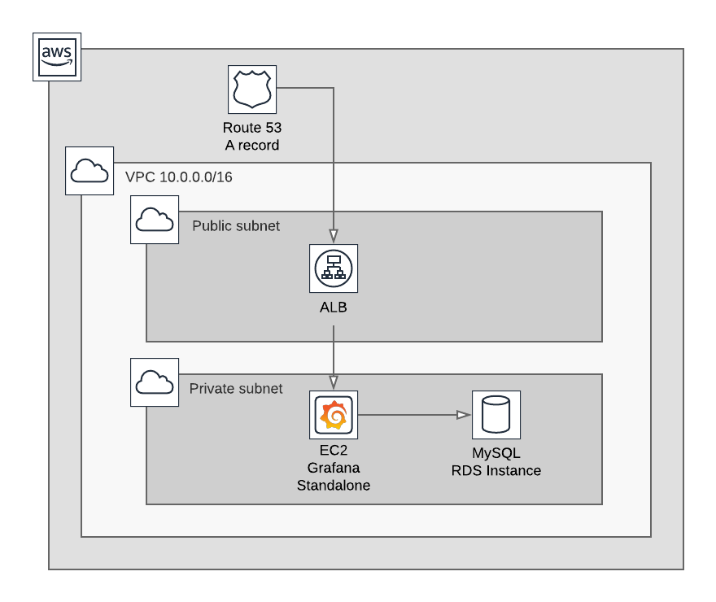

# TP 00

## But

Lancer une application Grafana (pas hautement disponible) sur AWS afin de
comprendre l'utilisation des EC2, ALB, SG et Route 53.

## Exercice

### Security groups

Créer 3 security groups:

  - particule-tp-webapp
  - particule-tp-alb
  - particule-tp-rds
  
`particule-tp-webapp` doit être accessible sur le port `3000` uniquement par `particule-tp-alb`.
`particule-tp-rds` doit être accessible sur le port `3306` uniquement par `particule-tp-webapp`.
`particule-tp-alb` doit être accessible sur les ports `80` et `443` par internet.

Tous les SG créés doivent être accessibles sur le port `22` par
`particule-tp-bastion`.

### RDS

Créer un `subnet group` en utilisant les 3 subnets privés dans le VPC
`particule-tp`.

Créer un cluster Aurora Serverless utilisant ce __subnet group__, le SG `particule-tp-rds`,
avec un base `grafana` et un utilisateur `root` avec un mot de passe définit
par vos soins.

Récupérer l'endpoint __read/write__ de ce cluster.

### ALB

Créer un ALB `particule-tp-alb` avec un target group par défaut `particule-tp-default` et
le SG `particule-tp-alb`.
Créer un target group `particule-tp-webapp` avec un _traffic port_ en `3000`, un
healthcheck sur le path `/login`.

Faire en sorte que les requêtes qui arrivent sur l'ALB avec le header `Host:
grafana.particule.com` soient _forward to_ le target group `particule-tp-webapp`
et les autres requêtes à `particule-tp-default`.

Faire en sorte que l'ALB redirige les requêtes HTTP vers HTTPS.

### EC2

Créer une instance EC2 de taille `t2.micro` sur un subnet privé du VPC
`particule-tp`, avec le SG `particule-tp-webapp` et la keypair `particule-tp`.

Se connecter en SSH à cette instance (via le bastion), installer Grafana,
configurer Grafana pour qu'il stock les sessions dans la base `grafana` sur le
cluster Aurora précédemment créé et qu'il utilise cette même base comme
backend.
Faire en sorte que Grafana démarre au démarrage de l'instance (`systemctl
enable grafana-server`).

### Route 53

Ajouter un record Route 53 de type A avec un Alias vers le l'ALB créé au
préalable.

### Schéma d'architecture

## Résultat

Grafana doit être accessible sur le endpoint Route 53, redirigé de HTTP vers
HTTPS automatiquement.
